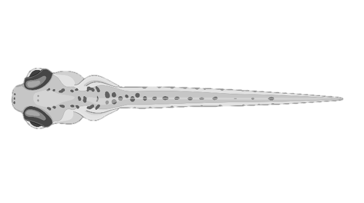

# Zebrafish Tail Animator


Python toolbox to transform zebrafish tracking data to tail animations

## Description

`zf_animator` is a Python package used to create visualisation of how swimming data looks from high-speed tracking data.
The typical data used should be the tail angle along segments of the tail.
The package will convert these tail angles to x- y- coordinates, and interpolate many more points along the range of tracked tail segments.
These sets of coordinates will then transform slices of the zebrafish image, producing a stack of .png files that can be rendered into an mp4 file.

## Package installation

This package can be installed via pip

```bash
pip install fish-simulator
```

Alternatively, you can download and locally install the package.

```bash
cd path/to/save/package
git clone clone-latest-tag git@github.com:ThomasMullen/fish_simulator.git
cd ./fish_simulator
python3 setup.py bdist_wheel sdist
pip install ./dist/fish_simulator-<latest_tag>.tar.gz
```

## Requires `ffmpeg`

### Installation instructions

To convert the `.png` files to an `.mp4` animation requires `ffmpeg` to be installed on the running computer.
This can be install in Ubuntu in the terminal:

```bash
sudo apt install ffmpeg
```

Or with OS X can be installed:

```bash
brew install ffmpeg
```

Check it is installed by running `which ffmpeg` in the terminal. More details can be found [here](https://github.com/kkroening/ffmpeg-python/tree/master).

### Dependencies

## Default Fish image



## Example

```python
from fish_simulator.simulator import make_simulation
make_simulation(tail_angle_data, upsample=4, "dir/to/save/png_files")
```

## Key Functions
